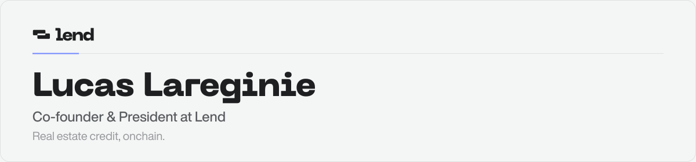

<picture>
  <source media="(prefers-color-scheme: dark)" srcset="./header-dark.svg">
  
</picture>

Tokenizing real estate credit and bringing real-world yield to stablecoin LPs.
Previously co-founded [Staky.io](https://staky.io) (staking-as-a-service, 20+ DPoS networks, $800M+ staked).

### Activity

<picture>
  <source media="(prefers-color-scheme: dark)" srcset="https://streak-stats.demolab.com/?user=Lucas-L&hide_border=true&background=0D1117&stroke=3C3E40&ring=7088FF&fire=7088FF&currStreakNum=F4F5F5&sideNums=F4F5F5&currStreakLabel=7088FF&sideLabels=96999C&dates=96999C">
  
</picture>

### Reach out

